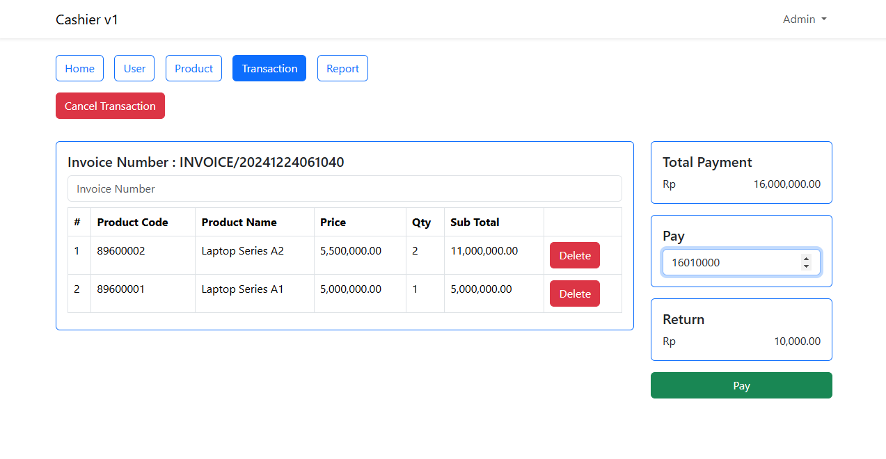

# Cashier App v1
This web is still development stage.


## Prerequisite:

- Composer >= 2.8
- PHP >= 8.3


## Screenshots




# Features

- Admin: CRUD (User & Product), Create Transaction & Report
- Cashier: Create Transaction & Report


## Run Locally

Clone the project

```bash
git clone https://github.com/brianajiks123/cashier-app-v1.git
```

Go to the project directory

```bash
cd cashier-app-v1
```

Install Dependencies

```bash
composer install
```

Migrate Database (make sure already setup your environment in the .env file)

```bash
php artisan migrate
```

Running Development

```bash
php artisan serve
```


## Tech Stack:

- Frontend: Livewire, Bootstrap
- Backend: Laravel 11, MySQL, Git, Github


## Acknowledgements

 - [Laravel](https://laravel.com/docs/11.x)
 - [Livewire](https://livewire.laravel.com/)
 - [YouTube](https://www.youtube.com/@KodingDulu)


## Authors

- [@brianajiks123](https://www.github.com/brianajiks123)
